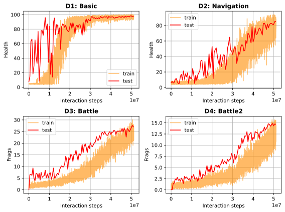

# Direct Future Prediction
This is a re-implementation of Direct Future Prediction in PyTorch.

If you use this code or the provided environments in your research, please cite the following paper:

```
@inproceedings{DK2017,
author    = {Alexey Dosovitskiy and Vladlen Koltun},
title     = {Learning to Act by Predicting the Future},
booktitle = {International Conference on Learning Representations (ICLR)},
year      = {2017}
}
```

## Sample Results




Small deviations from the paper results are due to: 
- the paper shows average and standard deviation over 3 runs.
- in the original code, every evaluation is a result of 50k interaction steps. The code
  here evaluates over 100 episodes regardless of episode lengths.
- the paper results are produced with a modified version of vizdoom.

## Usage
This code base uses [`sacred`](https://github.com/IDSIA/sacred) to manage configurations and track
 metrics and artifacts.
 
You can run the experiments for each scenario with

```bash
python launch.py with configs/$SCENARIO_NAME.yaml
```
where `SCENARIO_NAME` can be one of {'basic', 'navigation', 'battle', 'battle2'}.

If you want to store configuration, metrics and artifacts in files, use 

```bash
python launch.py with configs/$SCENARIO_NAME.yaml -F $SAVE_DIR
```
where `SAVE_DIR` is the directory path to save under.

For different kinds of storage options (e.g. databases), check [sacred's documentation](https://sacred.readthedocs.io/en/stable/observers.html#).


## Official Implementation
The official implementation of the paper in tensorflow can be found [here](https://github.com/intel-isl/DirectFuturePrediction).
